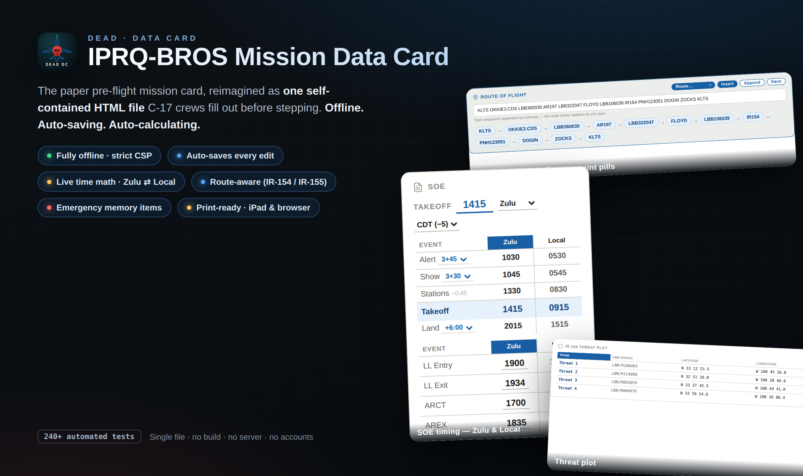

# IPRQ-BROS Mission Data Card (MDC)



A single-file, offline mission data card for C-17 pilots. Open it on an iPad
or in a browser, fill in the pre-flight card, and everything you type is saved
locally on the device — no network, no accounts, no servers.

> **One file does it all.** The entire app — layout, styling, and logic — lives
> in [`IP_REQUAL_BROS__Mission_Check.html`](IP_REQUAL_BROS__Mission_Check.html).
> Copy that file anywhere and it just works.

---

## Contents

- [What it is](#what-it-is)
- [Features](#features)
- [The six tabs](#the-six-tabs)
- [Using the card](#using-the-card)
- [Saving, loading & resetting](#saving-loading--resetting)
- [Printing](#printing)
- [Offline & privacy](#offline--privacy)
- [For developers](#for-developers)
- [Updating the master file](#updating-the-master-file)
- [Branding](#branding)

---

## What it is

A self-contained static web page that replaces the paper mission data card. It
is built for the **IP requal / "BROS"** syllabus and pre-seeded with a realistic
flight configuration (callsign, route, SOE timings, AR track, low-level entry,
safety supplements, EFB currency, etc.). Pilots adjust the fields for the day's
sortie; the card auto-calculates the time-critical values and remembers
everything between sessions.

- **Runs offline.** Strict Content-Security-Policy, no external resources at
  runtime. Works from `file://`, a thumb drive, or any static host.
- **Auto-saving.** Every edit is written to the browser's `localStorage`, so
  closing and reopening the page restores your card exactly as you left it.
- **Auto-calculating.** Enter a takeoff time (or LL entry, ARCT, etc.) and the
  dependent times fill themselves in — in both Zulu and local time.
- **Portable.** Export the whole card to a JSON file to share or back up, and
  re-import it on any device.

---

## Features

- **Six task-organized tabs** — Brief, AR, Low Level, Tactical, GK, Scenario.
- **Sequence of Events (SOE) calculator** — type a Takeoff time and the Alert /
  Show / Stations / Land rows back- and forward-calculate automatically, shown
  side-by-side in **Zulu and Local** (Central, with a CDT/CST toggle).
  The manual rows (LL Entry, LL Exit, ARCT, AREX) are entered in Zulu and show
  a calculated local time beside each.
- **Route-aware low-level data** — pick the route (e.g. IR-154 / IR-155) and the
  card swaps in the correct entry/exit points, LZ TOTs, entry-fix times, and a
  route diagram. The two route dropdowns stay in sync.
- **Air Refueling block** — select the AR track and the frequencies, TACAN, and
  altitude block populate; AR speed derives from the tanker type (KC-135 → 265,
  KC-46 → 275).
- **Editable checklists everywhere** — Descent, Combat Entry, Route Activation,
  PFARTSS, Approach, Low Level Entry, Scenario Objectives, LZ Check-In, and
  Combat Exit are all add/remove/indent lists with sensible defaults.
- **Reference cards** — quick-reference tables (IR/VR/SR comparison, Time
  Control / atmospheric model, etc.) baked into the relevant tabs.
- **Save / Load / Reset** the entire card, with one-tap **Undo** after a Reset
  or Load.
- **Print-friendly** — clean per-tab print headers; the on-screen toolbar is
  hidden when printing.
- **"Last updated" footer** — a build stamp showing when the master file was
  last revised (see [Updating the master file](#updating-the-master-file)).

---

## The six tabs

| Tab | What's on it |
|-----|--------------|
| **Brief** | The main board — header/crew, Route of Flight, SOE timing table, Air Refueling, Low Level info, Ground Ops, Pattern Work, Safety Supplements, FCIF/SII, EFB currency, Briefings/Notes, Box Setup Sequence. |
| **AR** | Air-refueling detail and references. |
| **Low Level** | The low-level mission flow — editable Descent/Combat Entry/Route Activation/PFARTSS/Approach checklists, route-dependent Low Level Entry & Scenario Objectives, and the GK reference section (IR/VR/SR table, Time Control card). |
| **Tactical** | Tactical general-knowledge reference. |
| **GK** | General-knowledge / life-support reference. |
| **Scenario** | Scenario notes and objectives. |

---

## Using the card

1. **Open** `IP_REQUAL_BROS__Mission_Check.html` in a browser (Chrome, Edge, or
   Safari/iPad). Double-clicking the file works — no server needed.
2. **Pick the tab** for the area you're filling in.
3. **Type into any field.** Times, names, frequencies, list items — edit them
   directly. Calculated fields update as you go.
4. **Add/remove list rows** with the `+ item` and `×` buttons; use the indent
   button to make a row a sub-item.
5. **It saves itself.** There's no Save button for normal editing — your changes
   persist automatically on the device.

### Tips

- Set the **Takeoff** time on the Brief tab first; the SOE table fills in from
  it. Use the **CDT/CST** toggle to control the local-time column.
- Choose the **route** once — the low-level entry points, LZ TOTs, entry-fix
  times, and route diagram all follow it.
- Times are **HHMM, 24-hour**. Local times in the card carry an `L` suffix; the
  master-file footer stamp is in Zulu (`Z`).

---

## Saving, loading & resetting

The toolbar at the top of the page (hidden when printing) has:

| Button | What it does |
|--------|--------------|
| **Download** | Saves a copy of the whole app (HTML) to your device. |
| **Save Data** | Exports the current card's data to a `.json` file you can share or back up. |
| **Load Data** | Imports a previously saved `.json` card and reloads with it. |
| **Reset** | Restores all fields to the built-in defaults. |

- **Undo:** after a Reset or Load, a one-tap **Undo** offer appears so you can
  recover the previous card if it was a mistake.
- Your data also lives in the browser under the key `iprq-bros-mdc-v1`. Clearing
  the browser's site data will wipe an unsaved card — export to JSON first if you
  want a backup.

---

## Printing

Use the browser's normal Print (⌘P / Ctrl-P). The toolbar and tab chrome are
suppressed, and each tab prints with its own header so a printed card is clean
and self-labeling.

---

## Offline & privacy

- **No network calls.** The page declares a strict Content-Security-Policy
  (`default-src 'none'`), so it cannot load fonts, scripts, images, or analytics
  from anywhere. The app icon is embedded directly in the file.
- **Your data stays on the device.** Everything you type is kept in the
  browser's local storage and in any JSON files you choose to export. Nothing is
  transmitted.

---

## For developers

### Requirements

- Any static file server for local preview (Python's built-in one is fine).
- [Node.js](https://nodejs.org/) + [Playwright](https://playwright.dev/) to run
  the regression suite.

### Preview locally

```bash
python3 -m http.server 8000
# then open http://127.0.0.1:8000/IP_REQUAL_BROS__Mission_Check.html
```

### Run the tests

```bash
npm install            # installs Playwright (dev dependency)
npx playwright install chromium
npm test               # serves the file and runs tests/regression.mjs
```

`npm test` starts a local server, runs the Playwright suite, and tears the
server down. Override the target with `BASE_URL=…` to test a downloaded copy.
The suite currently has **211 checks** and must stay green for any change.

### Project layout

```
IP_REQUAL_BROS__Mission_Check.html   ← the entire app (HTML + CSS + JS in one file)
icon.svg                             ← master app/favicon (embedded in the HTML as a data-URI)
tests/regression.mjs                 ← Playwright regression suite
HANDOFF.md                           ← deep implementation notes for maintainers
guides/                              ← supplemental study/reference HTML (not part of the app)
package.json                         ← test script + Playwright dev dependency
```

### How it's built

- **Single file.** All markup, styles, and logic are in the one HTML file.
  There is no build step — edit and refresh.
- **Persistence.** State is gathered from the DOM and written to `localStorage`
  on every `input`/`change`; on load it's replayed back over the defaults.
  Writes are gated until init finishes so defaults never clobber saved state.
- **Defaults versioning.** When a baked-in default changes, bump
  `MDC_DEFAULTS_VERSION`; pilots with older saved cards get an
  "Apply latest brief data" banner that refreshes the canonical fields while
  keeping their own edits.

See **[`HANDOFF.md`](HANDOFF.md)** for the full architecture, the dynamic-list
helper map, route/SVG data, and the list of gotchas (e.g. don't rename input
IDs without a migration; tests are order-sensitive).

---

## Updating the master file

When you publish a change to the master card, **bump the footer's build stamp**
so viewers can see when it was last updated. The stamp is a single constant near
the top of the script block:

```js
var MDC_LAST_UPDATED = '21 Jun 2026 · 1439Z';   // ← set to the push time (Zulu)
```

Set it to the current time with:

```bash
date -u "+%d %b %Y · %H%MZ"
```

It renders in the footer as **`Last updated 21 Jun 2026 · 1439Z`** and is
independent of any individual pilot's edits.

---

## Branding

The card is part of the **"DEAD"** product family (Dashboard, MP planner, this
data card). Shared cues: dark field, red gradient skull, range-ring reticle, and
a green north tick. This app's unique mark is a **C-17 planform in card-blue
(`#185FA5`)** with a `DEAD DC` banner. The master art is
[`icon.svg`](icon.svg), embedded in the page `<head>` as a CSP-safe data-URI.

---

*Internal tool for IP requal training. Not for operational use.*
